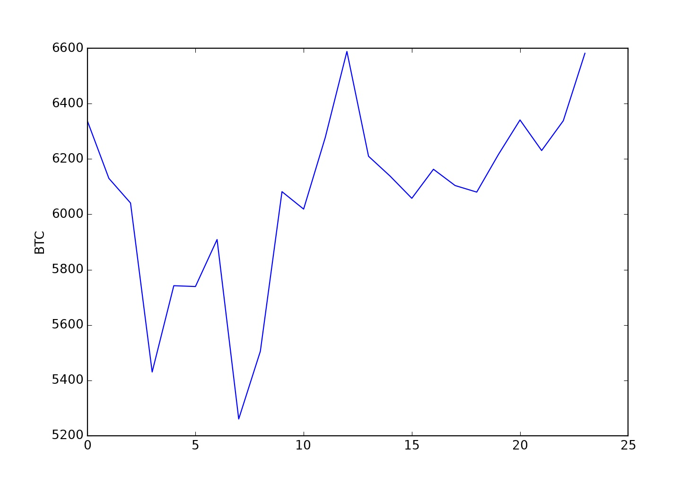
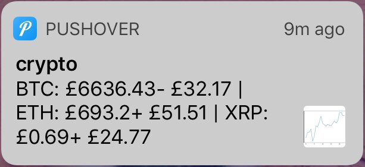
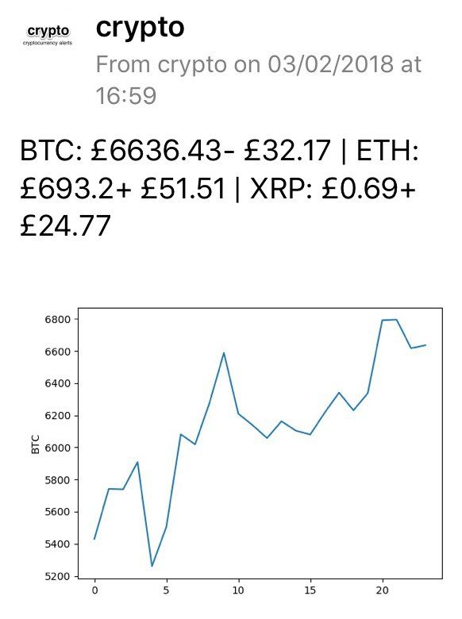

   
The *example* application sends a Pushover alert and a message to my pnut.io 'dev' channel:

* Three cryptocurrency value equivalents in GBP,
* the user's holding, also in GBP,
* their movement within the preceding hour,
* a message if any exceeds a value hard coded within the application.
* A graph of upto the last 24 hours' movements is created for each currency and saved in the application folder, and the BTC graph is added to the Pushover alert message (though not the pnut.io message yet.)

Application is currently tested in Pythonista and at pythonanywhere.com and my web host. Runs every hour either as a pythonanywhere 'task' or a cron job at my web host.

### Prerequisites:
* pnut.io and Pushover account application and user tokens - read from separate files to give some portability to the code:
 * `pnut_app_token.txt`
 * `pushover_app_token.txt`
 * `pushover_user_token.txt`
* The PNUTpy libraries: `pip install pnutpy`.
* For graphing: `pip install matplotlib`. *(I thought this was installed already at my web host, but it's possibly not available at crypto v0.7.)*
* One text file for each of the cryptocurrencies desired, named as crypto_(currency 3 letter name)_values.txt, e.g. `crypto_btc_values.txt`. Note: the 'btc' file is necessary, it's the only one sent as a Pushover alert.

### The entire `get_price` function is taken from:
https://github.com/jakewmeyer/Crypto - which uses the basic data from https://www.cryptonator.com/api    
Tiny modification: its `data` variable is converted to global for use outside the routine.

### What does it look like?
An alert (iOS): 
   
An expanded message (iOS):
